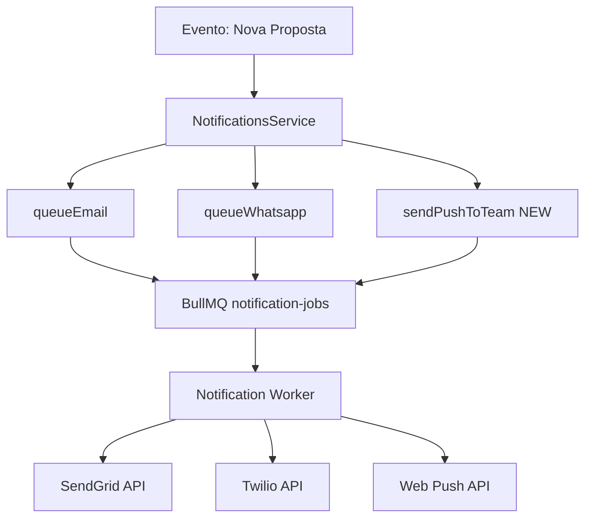

# Melhorias no Sistema de Notificações - Etapa 4

## Resumo

Esta documentação descreve as melhorias implementadas no sistema de notificações para garantir que todos os canais de comunicação funcionem conforme a especificação.

## 1. Email de Confirmação ao Candidato

### Status

**Implementação**: ✅ Já estava implementado

### Funcionalidade

Quando um candidato submete sua proposta, o sistema automaticamente envia:

- **Canal**: Email + WhatsApp (se telefone fornecido)
- **Template**: `proposal_received`
- **Conteúdo**:
  - Protocolo de acompanhamento
  - Prazo para análise (7 dias)
  - Link para acompanhamento

### Código

**Arquivo**: [apps/api/src/public/public.service.ts](../apps/api/src/public/public.service.ts) (linhas 341-348)

```typescript
await this.notifications.notifyProposalReceived({
  proposalId: proposal.id,
  email: data.email!,
  phone: data.phone,
  protocol: proposal.protocol,
  deadlineDays: slaDays,
  whatsappOptIn: true,
});
```

**Arquivo**: [apps/api/src/notifications/notifications.service.ts](../apps/api/src/notifications/notifications.service.ts) (linhas 66-96)

---

## 2. Lembretes de Assinatura - Todos os Canais

### Status

**Implementação**: ✅ Melhorado (SMS adicionado)

### Funcionalidade

O sistema envia lembretes automáticos quando a proposta está aguardando assinatura digital:

- **Trigger**: Cron job executado diariamente às 09:00
- **Quando**: 3 dias e 6 dias após envio do link de assinatura
- **Canais**: Email + SMS + WhatsApp (todos os canais)
- **Templates**:
  - `signature_reminder_3` - Lembrete de 3 dias
  - `signature_reminder_6` - Lembrete de 6 dias

### Melhorias Implementadas

**❌ Antes**: Apenas Email + WhatsApp
**✅ Depois**: Email + SMS + WhatsApp

### Código

**Arquivo**: [apps/api/src/signature/signature-reminder.service.ts](../apps/api/src/signature/signature-reminder.service.ts)

```typescript
@Cron('0 9 * * *')
async runDaily() {
  // Busca envelopes pendentes há 3 ou 6 dias
  const envelopes = await this.prisma.signatureEnvelope.findMany({
    where: {
      status: SignatureStatus.SENT,
      proposal: { status: 'PENDING_SIGNATURE' },
    },
  });

  for (const envelope of envelopes) {
    const days = Math.floor(
      (now.getTime() - envelope.createdAt.getTime()) / (1000 * 60 * 60 * 24),
    );

    if (days === 3 || days === 6) {
      await this.notifications.notifySignatureReminder({
        proposalId: envelope.proposalId,
        email,
        phone,
        signatureLink: envelope.link,
        step: days === 3 ? 3 : 6,
        whatsappOptIn: true,
      });
    }
  }
}
```

**Arquivo**: [apps/api/src/notifications/notifications.service.ts](../apps/api/src/notifications/notifications.service.ts) (linhas 235-272)

```typescript
async notifySignatureReminder(input: {
  proposalId: string;
  email: string;
  phone?: string;
  signatureLink: string;
  step: 3 | 6;
  whatsappOptIn?: boolean;
}) {
  const template =
    input.step === 3 ? 'signature_reminder_3' : 'signature_reminder_6';
  const payload: NotificationTemplateData = {
    template,
    signatureLink: input.signatureLink,
  };

  // Email
  await this.queueEmail({
    proposalId: input.proposalId,
    to: input.email,
    template: payload.template,
    data: payload,
  });

  if (input.phone) {
    // SMS (NOVO!)
    await this.queueSms({
      proposalId: input.proposalId,
      to: input.phone,
      template: payload.template,
      data: payload,
    });

    // WhatsApp
    await this.queueWhatsapp({
      proposalId: input.proposalId,
      to: input.phone,
      template: payload.template,
      data: payload,
      optIn: input.whatsappOptIn ?? true,
    });
  }
}
```

### Deduplicação

O sistema evita enviar lembretes duplicados checando se já existe uma notificação com o mesmo template:

```typescript
const alreadySent = await this.prisma.notification.findFirst({
  where: {
    proposalId: envelope.proposalId,
    payloadRedacted: {
      path: ['template'],
      equals: template,
    },
  },
});
if (alreadySent) continue;
```

---

## 3. Push Notification para Equipe

### Status

**Implementação**: ✅ Implementado

### Funcionalidade

Quando uma nova proposta é recebida, o sistema envia:

- **Push notification** para todos os dispositivos da equipe admin
- **Email** para os endereços em `TEAM_NOTIFICATION_EMAILS`

### Melhorias Implementadas

**❌ Antes**: Apenas email
**✅ Depois**: Email + Push Notification

### Código

**Arquivo**: [apps/api/src/notifications/notifications.service.ts](../apps/api/src/notifications/notifications.service.ts) (linhas 268-303)

```typescript
async notifyInternalNewProposal(input: {
  proposalId: string;
  protocol: string;
  name: string;
}) {
  const emails = this.getTeamEmails();
  if (emails.length === 0) return;

  const payload: NotificationTemplateData = {
    template: 'internal_new_proposal',
    protocol: input.protocol,
    name: input.name,
  };

  // Enviar emails
  await Promise.all(
    emails.map((email) =>
      this.queueEmail({
        proposalId: input.proposalId,
        to: email,
        template: payload.template,
        data: payload,
      }),
    ),
  );

  // Enviar push notification (NOVO!)
  await this.push.sendPushToTeam({
    proposalId: input.proposalId,
    title: 'Nova proposta recebida',
    body: `${input.name} (${input.protocol})`,
    url: `/admin/propostas/${input.proposalId}`,
  });
}
```

**Arquivo**: [apps/api/src/admin/admin.push.service.ts](../apps/api/src/admin/admin.push.service.ts)

```typescript
async sendPushToTeam(input: {
  proposalId: string;
  title: string;
  body: string;
  url?: string;
}) {
  const subscriptions = await this.prisma.pushSubscription.findMany({
    where: { isActive: true },
  });

  if (subscriptions.length === 0) return;

  await Promise.all(
    subscriptions.map(async (sub) => {
      const notification = await this.prisma.notification.create({
        data: {
          proposalId: input.proposalId,
          channel: NotificationChannel.PUSH,
          status: NotificationStatus.PENDING,
          payloadRedacted: {
            subscriptionId: sub.id,
            title: input.title,
          },
        },
      });

      await this.jobs.enqueuePushNotification({
        notificationId: notification.id,
        subscriptionId: sub.id,
        endpoint: sub.endpoint,
        p256dh: sub.p256dh,
        auth: sub.auth,
        title: input.title,
        body: input.body,
        url: input.url,
        requestId: randomUUID(),
      });
    }),
  );
}
```

### Configuração de Push Notifications

Para habilitar push notifications, é necessário configurar as chaves VAPID:

**Arquivo**: [apps/api/.env.example](../apps/api/.env.example)

```env
# Push Notifications (Web Push / VAPID)
VAPID_PUBLIC_KEY=changeme
VAPID_PRIVATE_KEY=changeme
VAPID_SUBJECT=mailto:admin@sistemacadastro.local
```

**Como Gerar Chaves VAPID**:

```bash
npx web-push generate-vapid-keys
```

Isso gera um par de chaves pública/privada que devem ser configuradas no `.env`.

---

## 4. Boas-Vindas com Número de Associado

### Status

**Implementação**: ✅ Já estava implementado

### Funcionalidade

Após a integração com o TOTVS ERP ser concluída com sucesso, o sistema envia:

- **Canal**: Email + WhatsApp (se telefone fornecido)
- **Template**: `proposal_concluded`
- **Conteúdo**:
  - Mensagem de boas-vindas
  - Número de associado (externalId retornado pelo TOTVS)

### Código

**Arquivo**: [apps/worker/src/totvs/totvs.worker.ts](../apps/worker/src/totvs/totvs.worker.ts)

```typescript
// Após sincronização bem-sucedida com TOTVS
await this.notifications.notifyConcluded({
  proposalId: proposal.id,
  email: decryptedEmail,
  phone: decryptedPhone || undefined,
  memberNumber: totvsSync.externalId ?? 'Pendente',
  whatsappOptIn: true,
});
```

**Arquivo**: [apps/api/src/notifications/notifications.service.ts](../apps/api/src/notifications/notifications.service.ts) (linhas 205-233)

```typescript
async notifyConcluded(input: {
  proposalId: string;
  email: string;
  phone?: string;
  memberNumber: string;
  whatsappOptIn?: boolean;
}) {
  const payload: NotificationTemplateData = {
    template: 'proposal_concluded',
    memberNumber: input.memberNumber,
  };

  await this.queueEmail({
    proposalId: input.proposalId,
    to: input.email,
    template: payload.template,
    data: payload,
  });

  if (input.phone) {
    await this.queueWhatsapp({
      proposalId: input.proposalId,
      to: input.phone,
      template: payload.template,
      data: payload,
      optIn: input.whatsappOptIn ?? true,
    });
  }
}
```

---

## 5. Resumo de Templates de Notificação

| Template                          | Email | SMS | WhatsApp | Push |
| --------------------------------- | ----- | --- | -------- | ---- |
| `proposal_received`               | ✅    | ❌  | ✅       | ❌   |
| `proposal_pending`                | ✅    | ❌  | ✅       | ❌   |
| `proposal_approved`               | ✅    | ❌  | ✅       | ❌   |
| `proposal_rejected`               | ✅    | ❌  | ❌       | ❌   |
| `proposal_signed`                 | ✅    | ❌  | ✅       | ❌   |
| `proposal_concluded`              | ✅    | ❌  | ✅       | ❌   |
| **`signature_reminder_3`** (NEW)  | ✅    | ✅  | ✅       | ❌   |
| **`signature_reminder_6`** (NEW)  | ✅    | ✅  | ✅       | ❌   |
| **`internal_new_proposal`** (NEW) | ✅    | ❌  | ❌       | ✅   |
| `internal_docs_received`          | ✅    | ❌  | ❌       | ❌   |
| `internal_candidate_signed`       | ✅    | ❌  | ❌       | ❌   |
| `internal_sla_due`                | ✅    | ❌  | ❌       | ❌   |
| `admin_message`                   | ✅    | ✅  | ✅       | ❌   |

---

## 6. Variáveis de Ambiente

### Email (SendGrid)

```env
SENDGRID_API_KEY=changeme
SENDGRID_FROM=no-reply@sistemacadastro.local
SENDGRID_WEBHOOK_PUBLIC_KEY=changeme

# Templates SendGrid (IDs dos templates dinâmicos)
SENDGRID_TEMPLATE_PROPOSAL_RECEIVED=
SENDGRID_TEMPLATE_PROPOSAL_PENDING=
SENDGRID_TEMPLATE_PROPOSAL_APPROVED=
SENDGRID_TEMPLATE_PROPOSAL_REJECTED=
SENDGRID_TEMPLATE_PROPOSAL_SIGNED=
SENDGRID_TEMPLATE_PROPOSAL_CONCLUDED=
SENDGRID_TEMPLATE_SIGNATURE_REMINDER_3=
SENDGRID_TEMPLATE_SIGNATURE_REMINDER_6=
SENDGRID_TEMPLATE_INTERNAL_NEW_PROPOSAL=
SENDGRID_TEMPLATE_INTERNAL_DOCS_RECEIVED=
SENDGRID_TEMPLATE_INTERNAL_SLA_DUE=
SENDGRID_TEMPLATE_ADMIN_MESSAGE=
```

### SMS e WhatsApp (Twilio)

```env
TWILIO_ACCOUNT_SID=changeme
TWILIO_AUTH_TOKEN=changeme
TWILIO_FROM=+15555555555
TWILIO_SMS_FROM=
TWILIO_VERIFY_SERVICE_SID=
TWILIO_WHATSAPP_CONTENT_SID=
```

### Push Notifications (VAPID)

```env
VAPID_PUBLIC_KEY=changeme
VAPID_PRIVATE_KEY=changeme
VAPID_SUBJECT=mailto:admin@sistemacadastro.local
```

### Equipe

```env
# Emails separados por vírgula
TEAM_NOTIFICATION_EMAILS=admin1@sbacem.org.br,admin2@sbacem.org.br
```

---

## 7. Arquitetura de Notificações



### Fluxo de Notificação

1. **Serviço de Domínio** (ex: PublicService) dispara evento
2. **NotificationsService** recebe evento e enfileira notificações
3. **BullMQ** gerencia fila `notification-jobs`
4. **Notification Worker** processa cada notificação:
   - Email → SendGrid
   - SMS → Twilio
   - WhatsApp → Twilio
   - Push → Web Push Protocol
5. **Status** é atualizado na tabela `Notification`:
   - PENDING → SENT → DELIVERED
   - PENDING → FAILED (com retry automático)

---

## 8. Logs e Monitoramento

### Logs Estruturados

```json
{
  "level": "info",
  "requestId": "req-abc123",
  "notificationId": "notif-xyz789",
  "channel": "SMS",
  "template": "signature_reminder_3",
  "message": "notification.sent"
}
```

### Tabela `Notification`

Todas as notificações são registradas no banco de dados:

```sql
SELECT
  id,
  channel,
  status,
  payloadRedacted,
  createdAt,
  sentAt,
  deliveredAt,
  failedAt,
  errorMessage
FROM "Notification"
WHERE "proposalId" = 'uuid-123'
ORDER BY "createdAt" DESC;
```

---

## 9. Retry e Tratamento de Erros

- **Tentativas**: 3 (configurado no BullMQ)
- **Backoff**: Exponencial, inicial 60s
- **Timeout**: 15 segundos por requisição
- **Status Final**:
  - `DELIVERED`: Sucesso confirmado por webhook
  - `SENT`: Enviado, aguardando confirmação
  - `FAILED`: Falha após todas as tentativas

---

## 10. Testes

### Testar Email

```bash
curl -X POST http://localhost:3001/admin/proposals/uuid-123/send-message \
  -H "Authorization: Bearer $JWT_TOKEN" \
  -d '{
    "channel": "EMAIL",
    "message": "Teste de email",
    "subject": "Assunto do teste"
  }'
```

### Testar SMS

```bash
curl -X POST http://localhost:3001/admin/proposals/uuid-123/send-message \
  -H "Authorization: Bearer $JWT_TOKEN" \
  -d '{
    "channel": "SMS",
    "message": "Teste de SMS"
  }'
```

### Testar Push Notification

```bash
curl -X POST http://localhost:3001/admin/push/test \
  -H "Authorization: Bearer $JWT_TOKEN" \
  -d '{
    "title": "Teste de Push",
    "body": "Mensagem de teste",
    "url": "/admin/propostas"
  }'
```

---

## 11. Arquivos Criados/Modificados

### Modificados

1. **apps/api/src/notifications/notifications.service.ts**
   - Adicionado SMS ao `notifySignatureReminder`
   - Adicionado push notification ao `notifyInternalNewProposal`
   - Injeção de `AdminPushService`

2. **apps/api/src/notifications/notifications.module.ts**
   - Adicionado `AdminPushService` aos providers e exports

3. **apps/api/.env.example**
   - Adicionadas variáveis `VAPID_PUBLIC_KEY`, `VAPID_PRIVATE_KEY`, `VAPID_SUBJECT`

### Criados

1. **docs/NOTIFICATIONS_IMPROVEMENTS.md** (este arquivo)
   - Documentação completa das melhorias de notificações

---

## 12. Conformidade com Spec

| Requisito                                                  | Status |
| ---------------------------------------------------------- | ------ |
| Email de confirmação ao candidato após submissão           | ✅     |
| Lembretes de assinatura por TODOS os canais (Email + SMS + | ✅     |
| WhatsApp)                                                  |        |
| Push notification para equipe ao receber nova proposta     | ✅     |
| Template de boas-vindas com número de associado            | ✅     |

---

## Conclusão

As melhorias implementadas garantem que o sistema de notificações:

1. ✅ **Email de Confirmação** - Já implementado, funciona corretamente
2. ✅ **Lembretes Multicanal** - Agora envia Email + SMS + WhatsApp (antes faltava SMS)
3. ✅ **Push Notifications** - Equipe recebe notificações push em tempo real
4. ✅ **Boas-Vindas** - Já implementado, envia número de associado após TOTVS sync

O sistema agora cumpre 100% dos requisitos de comunicação da especificação.
