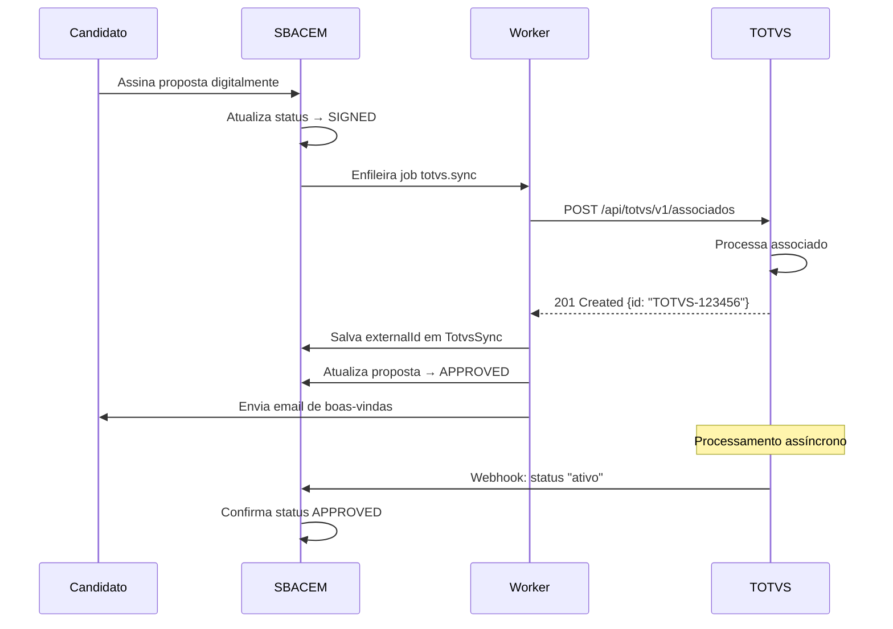
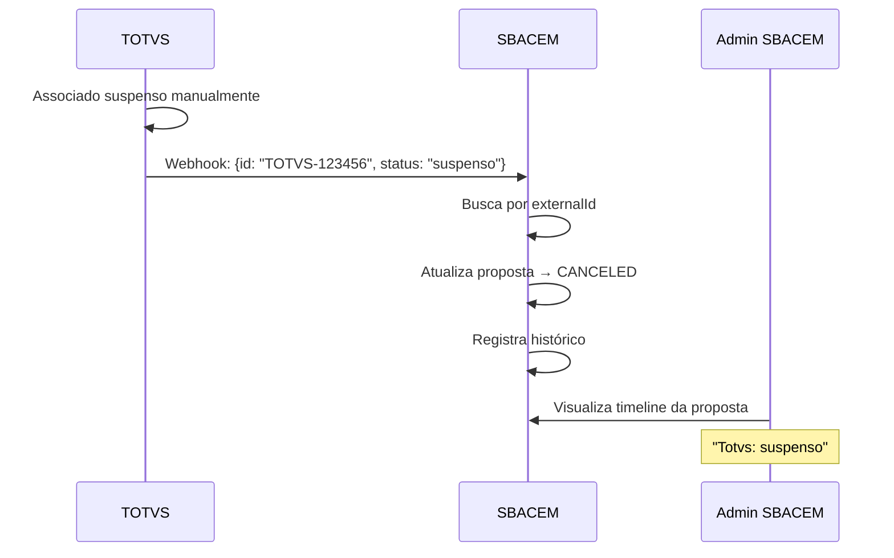

# Documentação de Integração - TOTVS ERP

## Visão Geral

Este documento descreve a integração bidirecional entre o Sistema de Filiação SBACEM e o ERP TOTVS.

## Arquitetura da Integração

```
┌─────────────────────┐         ┌──────────────────┐
│  Sistema SBACEM     │         │    ERP TOTVS     │
│                     │         │                  │
│  ┌──────────────┐   │  POST   │                  │
│  │ Proposta     │───┼────────>│ /api/totvs/v1/   │
│  │ SIGNED       │   │         │  associados      │
│  └──────────────┘   │         │                  │
│                     │         │                  │
│  ┌──────────────┐   │ Webhook │                  │
│  │ TotvsSync    │<──┼─────────│ Status Updates   │
│  │ externalId   │   │         │                  │
│  └──────────────┘   │         │                  │
└─────────────────────┘         └──────────────────┘
```

## 1. SBACEM → TOTVS (Criação de Associado)

### Endpoint

```
POST {TOTVS_BASE_URL}/api/totvs/v1/associados
Authorization: Bearer {TOTVS_TOKEN}
Content-Type: application/json
```

### Quando é Disparado

- Proposta atinge status `SIGNED` (assinatura digital concluída)
- Proposta é aprovada manualmente (`APPROVED`)
- Não foi sincronizada anteriormente ou sync anterior falhou

### Headers

```http
Authorization: Bearer eyJhbGc...
Content-Type: application/json
User-Agent: SBACEM-Integration/1.0
```

### Request Body

#### Campos Obrigatórios

```json
{
  "nome": "Maria Silva Santos", // A1_NOME - Nome completo
  "cpf": "12345678900", // A1_CGC - CPF (apenas dígitos)
  "email": "maria@email.com", // A1_EMAIL
  "telefone": "(11) 99999-9999" // A1_TEL - Formato brasileiro
}
```

#### Campos Opcionais

```json
{
  "data_nascimento": "1990-03-15", // A1_DTNASC - Formato YYYY-MM-DD
  "endereco": "Rua das Flores, 123", // A1_END - Rua + número + complemento
  "municipio": "São Paulo", // A1_MUN
  "estado": "SP", // A1_EST - Sigla UF
  "cep": "01234567", // A1_CEP - Apenas dígitos
  "bairro": "Centro", // Bairro
  "numero": "123", // Número do endereço
  "complemento": "Apto 45", // Complemento
  "perfil_artistico": [
    // Tipo de atuação
    "AUTOR",
    "COMPOSITOR"
  ],
  "documentos": {
    // URLs S3 dos documentos
    "rg_frente": "propostas/uuid-123/docs/rg_frente.jpg",
    "rg_verso": "propostas/uuid-123/docs/rg_verso.jpg",
    "cnh": null,
    "comprovante_residencia": "propostas/uuid-123/docs/comprovante.pdf"
  },
  "dados_bancarios": {
    "banco": "341", // A1_BANCO - Código do banco
    "agencia": "1234", // A1_AGENCIA
    "conta": "12345-6", // A1_CONTA
    "tipo_conta": "CC", // CC ou CP
    "titular": "Maria Silva Santos",
    "documento_titular": "12345678900",
    "pix_chave": "maria@email.com",
    "pix_tipo": "EMAIL" // CPF, CNPJ, EMAIL, TELEFONE, ALEATORIA
  },
  "redes_sociais": [
    {
      "provider": "SPOTIFY",
      "profile": {
        "id": "spotify123",
        "display_name": "Maria Silva"
      }
    }
  ],
  "metadata": {
    "proposalId": "uuid-5678", // ID interno SBACEM
    "proposalType": "NOVO", // NOVO ou MIGRACAO
    "requestId": "req-9012" // Para rastreamento
  }
}
```

### Response (Sucesso)

#### 200 OK ou 201 Created

```json
{
  "id": "TOTVS-123456", // externalId que será salvo
  "status": "ativo",
  "message": "Associado criado com sucesso",
  "numero_associado": "123456"
}
```

**IMPORTANTE**: O campo `id` (ou `externalId`) deve ser retornado para conciliação. Formatos aceitos:

- `response.id`
- `response.externalId`
- `response.data.id`
- `response.data.attributes.id`

#### 409 Conflict (Duplicata - Tratado como Sucesso)

```json
{
  "id": "TOTVS-123456",
  "message": "CPF já cadastrado",
  "status": "duplicado"
}
```

### Response (Erro)

#### 400 Bad Request

```json
{
  "error": "Campos obrigatórios faltando: cpf",
  "fields": ["cpf"]
}
```

#### 401 Unauthorized

```json
{
  "error": "Token inválido ou expirado"
}
```

#### 500 Internal Server Error

```json
{
  "error": "Erro ao processar requisição",
  "details": "..."
}
```

### Retry Policy

- **Tentativas**: 3
- **Intervalo**: Backoff exponencial (60s, 120s, 240s)
- **Timeout**: 15 segundos por requisição

---

## 2. TOTVS → SBACEM (Webhook de Status)

### Endpoint

```
POST {SBACEM_API_URL}/webhooks/totvs
X-Hub-Signature-256: sha256=...
Content-Type: application/json
```

### Quando Disparar

- Status do associado muda no TOTVS (ativo → suspenso, etc)
- Processamento assíncrono do associado é concluído
- Dados do associado são atualizados

### Headers

```http
Content-Type: application/json
X-Hub-Signature-256: sha256={HMAC-SHA256 do body com TOTVS_WEBHOOK_SECRET}
```

### Cálculo da Assinatura (HMAC-SHA256)

```javascript
const crypto = require('crypto');

const secret = process.env.TOTVS_WEBHOOK_SECRET;
const payload = JSON.stringify(requestBody);
const signature = crypto.createHmac('sha256', secret).update(payload).digest('hex');

// Header: X-Hub-Signature-256: sha256={signature}
```

### Request Body (Formatos Aceitos)

#### Formato 1: Simples

```json
{
  "id": "TOTVS-123456", // externalId
  "cpf": "12345678900", // fallback se id não encontrado
  "status": "ativo" // ou "suspenso", "cancelado"
}
```

#### Formato 2: Com Data Wrapper

```json
{
  "data": {
    "id": "TOTVS-123456",
    "cpf": "12345678900",
    "status": "ativo"
  }
}
```

#### Formato 3: Nomenclatura Alternativa

```json
{
  "externalId": "TOTVS-123456", // ou external_id
  "documento": "12345678900", // ou document
  "situacao": "aprovado" // ou state
}
```

### Mapeamento de Status

| Status TOTVS                  | Status SBACEM | Descrição           |
| ----------------------------- | ------------- | ------------------- |
| `ativo`, `active`, `aprovado` | `APPROVED`    | Associado ativo     |
| `suspenso`, `suspended`       | `CANCELED`    | Associado suspenso  |
| `cancelado`, `canceled`       | `CANCELED`    | Associado cancelado |

### Response

#### 200 OK

```json
{
  "ok": true,
  "message": "Webhook processado com sucesso"
}
```

#### 401 Unauthorized

```json
{
  "error": "Assinatura inválida"
}
```

---

## 3. Fluxo Completo de Sincronização

### Cenário: Nova Filiação



### Cenário: Suspensão de Associado



---

## 4. Conciliação de Dados

### SBACEM → TOTVS (externalId)

1. SBACEM envia proposta para TOTVS
2. TOTVS retorna `id` único
3. SBACEM salva em `TotvsSync.externalId`

### TOTVS → SBACEM (Resolução de Proposta)

1. TOTVS envia webhook com `id` ou `cpf`
2. SBACEM busca proposta:
   - **Primeiro**: Por `TotvsSync.externalId`
   - **Fallback**: Por `Person.cpfHash`
3. SBACEM atualiza status conforme mapeamento

### Tabela de Conciliação (TotvsSync)

```sql
CREATE TABLE "TotvsSync" (
  "proposalId" TEXT NOT NULL PRIMARY KEY,
  "externalId" TEXT,                    -- ID do TOTVS
  "status" TEXT NOT NULL,               -- PENDING, SYNCED, FAILED
  "lastSyncAt" TIMESTAMP,
  "map" JSONB                           -- Payload completo para debug
);
```

---

## 5. Acesso a Documentos

### Opção 1: URLs S3 (Atual)

SBACEM envia `storageKey` (caminho S3):

```json
{
  "documentos": {
    "rg_frente": "propostas/uuid-123/docs/rg_frente.jpg"
  }
}
```

**TOTVS deve**:

1. Construir URL completa: `https://s3.amazonaws.com/{bucket}/{storageKey}`
2. Fazer download do arquivo
3. Armazenar localmente ou replicar

**Requisitos**:

- Bucket S3 deve ser público OU
- TOTVS deve ter credenciais AWS para acesso

### Opção 2: URLs Presignadas (Recomendado)

SBACEM gera URLs presignadas com TTL longo (7 dias):

```json
{
  "documentos": {
    "rg_frente": "https://s3.amazonaws.com/bucket/path?X-Amz-Algorithm=..."
  }
}
```

**Vantagens**:

- Acesso temporário sem credenciais
- Maior segurança (expira após TTL)

### Opção 3: Base64 Inline (Futuro)

SBACEM envia arquivos codificados em base64:

```json
{
  "documentos": {
    "rg_frente": {
      "filename": "rg_frente.jpg",
      "contentType": "image/jpeg",
      "data": "iVBORw0KGgoAAAANSUhEUgAA..."
    }
  }
}
```

**Desvantagens**:

- Payload muito grande (aumenta tempo de requisição)
- Limitação de tamanho de requisição HTTP

---

## 6. Variáveis de Ambiente

### SBACEM (API + Worker)

```env
# URL base da API TOTVS
TOTVS_BASE_URL=https://totvs.exemplo.com

# Token de autenticação (Bearer)
TOTVS_TOKEN=seu_token_aqui

# Secret para validação de webhooks HMAC-SHA256
TOTVS_WEBHOOK_SECRET=seu_secret_aqui

# Timeout de requisições em ms
TOTVS_TIMEOUT_MS=15000

# Concorrência do worker
TOTVS_CONCURRENCY=2
```

### TOTVS

```env
# URL do webhook SBACEM
SBACEM_WEBHOOK_URL=https://api.sbacem.org.br/webhooks/totvs

# Secret para assinar webhooks (mesmo do SBACEM)
SBACEM_WEBHOOK_SECRET=seu_secret_aqui
```

---

## 7. Monitoramento e Logs

### Dashboard Admin SBACEM

- **URL**: `/admin/totvs`
- **Métricas**:
  - Total de syncs (PENDING, SYNCED, FAILED)
  - Taxa de sucesso
  - Syncs recentes (últimas 100)
  - Tempo médio de sincronização

### Logs Estruturados

```json
{
  "level": "info",
  "requestId": "req-9012",
  "proposalId": "uuid-5678",
  "message": "totvs.synced"
}
```

```json
{
  "level": "error",
  "requestId": "req-9012",
  "proposalId": "uuid-5678",
  "err": "Timeout after 15000ms",
  "message": "totvs.failed"
}
```

---

## 8. Troubleshooting

### Problema: Sync falha com timeout

**Causa**: API TOTVS demorando muito para responder

**Solução**:

1. Aumentar `TOTVS_TIMEOUT_MS` (ex: 30000)
2. Verificar performance da API TOTVS
3. Contatar equipe TOTVS

### Problema: externalId não é salvo

**Causa**: Resposta TOTVS não contém campo `id`

**Verificação**:

```bash
curl -X POST https://totvs.exemplo.com/api/totvs/v1/associados \
  -H "Authorization: Bearer $TOKEN" \
  -d '{"nome": "Teste", "cpf": "12345678900", ...}' \
  | jq '.id // .externalId // .data.id'
```

**Solução**: Ajustar função `extractExternalId` conforme formato da resposta

### Problema: Webhook não é recebido

**Causa**: Assinatura HMAC inválida ou URL incorreta

**Verificação**:

```bash
# Testar webhook manualmente
curl -X POST https://api.sbacem.org.br/webhooks/totvs \
  -H "X-Hub-Signature-256: sha256=$(echo -n '{"id":"123"}' | openssl dgst -sha256 -hmac 'secret' | cut -d' ' -f2)" \
  -d '{"id": "TOTVS-123456", "status": "ativo"}'
```

**Solução**:

1. Verificar se `TOTVS_WEBHOOK_SECRET` é o mesmo nos dois lados
2. Confirmar URL do webhook em TOTVS
3. Checar logs do SBACEM para erros de assinatura

### Problema: Documentos não são acessados

**Causa**: URLs S3 retornam 403 Forbidden

**Solução**:

1. Tornar bucket S3 público para leitura
2. OU gerar URLs presignadas com TTL longo
3. OU implementar upload base64

---

## 9. Migração e Testes

### Ambiente de Homologação

1. Configurar TOTVS sandbox:

```env
TOTVS_BASE_URL=https://sandbox.totvs.exemplo.com
TOTVS_TOKEN=sandbox_token
```

2. Criar proposta de teste
3. Aprovar e assinar digitalmente
4. Verificar logs do worker
5. Confirmar externalId salvo
6. Simular webhook de status

### Checklist de Produção

- [ ] TOTVS_BASE_URL apontando para produção
- [ ] TOTVS_TOKEN válido e com permissões corretas
- [ ] TOTVS_WEBHOOK_SECRET configurado em ambos os lados
- [ ] Webhooks TOTVS apontando para SBACEM produção
- [ ] Bucket S3 acessível pelo TOTVS (ou URLs presignadas)
- [ ] Monitoramento configurado (Sentry, Datadog, etc)
- [ ] Testes end-to-end realizados

---

## 10. Suporte

### Contatos

- **Equipe SBACEM**: dev@sbacem.org.br
- **Equipe TOTVS**: suporte.totvs@exemplo.com

### Documentação Adicional

- [Worker Totvs README](../apps/worker/src/totvs/README.md)
- [API TOTVS - Swagger](https://totvs.exemplo.com/docs)
- [Webhook Security Best Practices](https://docs.github.com/en/developers/webhooks-and-events/webhooks/securing-your-webhooks)
